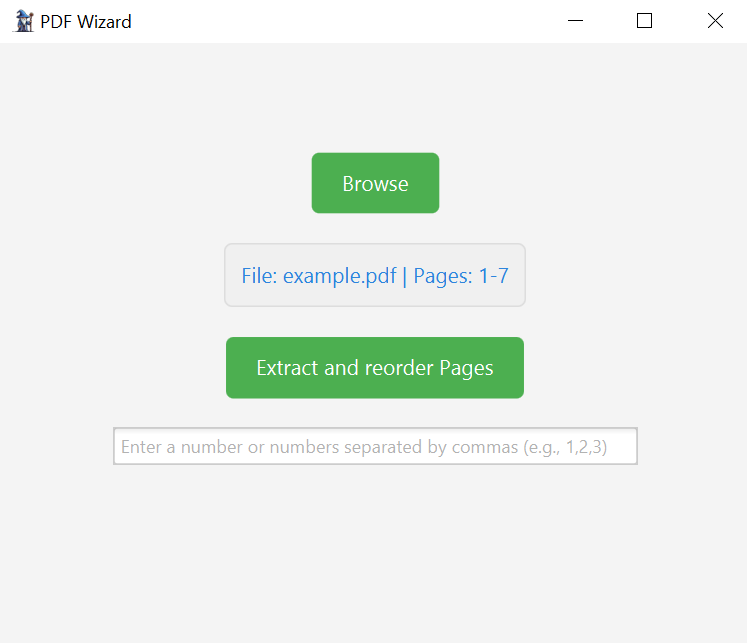

# PDF Wizard

## Description
PDF Wizard is a JavaFX application that allows users to edit PDF files. Key features include extracting pages, reordering pages, and displaying file information such as name and page count. The application features an intuitive user interface built with JavaFX and uses Apache PDFBox for PDF manipulation.

---

## Features
- **Browse PDF Files:** Select a PDF file using a file browser.
- **Display Page Information:** Displays the file name and page count.
- **Extract and Reorder Pages:** Users can extract and save pages in any order.
- **Responsive Layout:** Centered buttons and input fields with flexible spacing.

---

## Technologies
- **Programming Language:** Java 17
- **Libraries:**
  - JavaFX for the user interface
  - Apache PDFBox for PDF manipulation
- **Build Tool:** Maven

---

## Requirements
- **JDK:** Java 17 or higher
- **Maven:** Version 3.6 or higher

---

## Installation
1. **Clone the project:**
   ```bash
   git clone https://github.com/username/pdf-wizard.git
   cd pdf-wizard
   ```
2. **Install dependencies:**
   ```bash
   mvn install
   ```
3. **Run the project:**
   ```bash
   mvn javafx:run
   ```

---

## Directory Structure
```
src/
├── main/
│   ├── java/
│   │   ├── core/
│   │   │   ├── Main.java
│   │   ├── ui/
│   │   │   ├── MainUI.java
│   │   │   ├── UIManager.java
│   │   ├── pdf/
│   │   │   ├── PdfService.java
│   │   │   ├── PdfServiceImpl.java
│   ├── resources/
│       ├── style.css
│       ├── wizard.png
│       ├── wizard.ico
```

---

## Usage
1. Start the application.
2. Click **Browse** to select a PDF file.
3. File information (name and page count) will be displayed.
4. Use the input field to specify the pages to extract.
5. Click **Extract and reorder Pages** to apply changes.

---

## Example


**Main Window:**
- Buttons and input fields are centered.
- PDF information is displayed clearly.

---

## Author
Created by Andreas Mohr.

